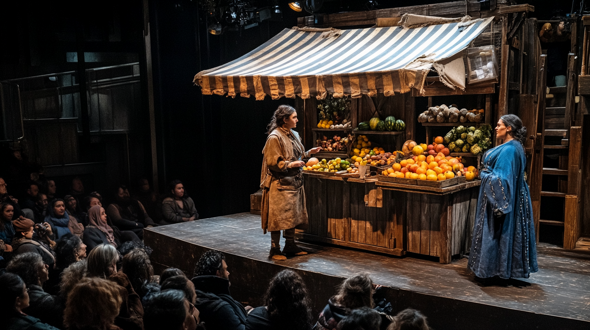

# An introduction to HTML and Canvas inline styling

## Working Subtitles

- _Like writing stage directions into every line_
- _When best practices meet reality_
- _Canvas won’t let us have nice things—so here we are._  
- _The 'we told you not to' guide to Canvas styling._  
- _It’s only weird if it doesn't work_
- _Because sometimes you just gotta do what you gotta do._  

A theater production as a metaphor for **HTML, CSS, and JavaScript**:

- **HTML** is the script: it defines the structure and content of the play, specifying what scenes exist and what characters will say.  
- **CSS** is the set design and costumes: it determines how everything looks, from the colors and textures of the backdrop to the characters' outfits.  
- **JavaScript** is the director: it adds dynamic actions and interactivity, deciding how the characters move, respond, or react during the performance.  

Together, they create a complete and engaging show.

Using the theater metaphor, writing HTML and CSS in **Canvas with inline styles** would be like a production where:

- The **script (HTML)** and the **set design (CSS)** are written directly into the actor's lines.  
- Instead of having a dedicated set designer (CSS) to manage and coordinate the visuals for the entire stage, each actor (HTML element) has their costumes and props defined individually, piece by piece, in the script itself.  

## Inline Styling

This approach is less efficient because:

1. **Redundancy**: Every actor (HTML element) has to repeat their costume details, even if several actors wear similar outfits.  
2. **Lack of scalability**: Making changes becomes labor-intensive because you need to update each individual actor’s lines instead of simply changing one centralized design plan.  
3. **Limited flexibility**: Adapting or reusing designs is more challenging since the styles are tightly coupled with the content.

In a proper theater production (separate HTML and CSS), the **set designer (CSS)** can define costumes and stage elements once. All actors (HTML) can reference them, making the production easier to scale and maintain. Using inline styles in Canvas forces you to juggle both roles directly in the script, limiting creative control and efficiency.

## Title: The Marketplace Scene (An "Inline Style" Production)

Mundorff, D. (2025). *A theater scene with two female actors conversing at a fruit stand; one in a tattered tunic, the other in a blue cloak* [Digital image]. MidJourney. https://cdn.midjourney.com/95693a77-7fbc-47ba-a1af-8b256838d1ab/0_1.png  

---

**SCENE: A bustling marketplace at dawn. The stage is awash in golden light. Stalls are packed with goods, and the air is thick with chatter.**

---

**ACTOR 1**  
*(Wearing a tattered brown tunic with a patched apron. A warm golden spotlight illuminates their face as they stand behind a wooden stall loaded with colorful fruit.)*  
"Good morning, neighbor! A fine day for selling wares, don't you think?"  
*(Still wearing a tattered brown tunic with a patched apron. The warm golden spotlight continues to illuminate their face. The wooden stall remains loaded with colorful fruit.)*

**ACTOR 2**  
*(Dressed in a long blue cloak embroidered with silver thread, standing slightly in the shadow of a hanging awning that casts diagonal lines across their face.)*  
"Indeed it is! The sun glints off the cobblestones, and the smell of fresh bread fills the air."  
*(Still dressed in a long blue cloak embroidered with silver thread. The hanging awning continues to cast diagonal lines across their face as they speak.)*

**ACTOR 1**  
*(Wearing a tattered brown tunic with a patched apron. The warm golden spotlight continues to illuminate their face as they lean forward against the wooden stall loaded with colorful fruit.)*  
"You’ve outdone yourself again. Those loaves look like golden treasures. How do you make them so perfect every time?"  
*(Their tattered brown tunic and patched apron remain unchanged. The warm golden spotlight stays fixed on their face.)*

**ACTOR 2**  
*(Dressed in a long blue cloak embroidered with silver thread, standing slightly in the shadow of a hanging awning.)*  
"Patience, care, and just a little magic."  
*(Their long blue cloak continues to shimmer under the dim shadow, unaffected by any lighting changes yet.)*

**ACTOR 3**  
*(Entering slowly from stage left, their dark cloak billowing as the breeze picks up. The cold blue light casts sharp shadows across their figure. Their boots clink heavily on the cobblestones, and a soft rumble of thunder rolls in the background.)*  
"Trouble, you say? I fear you haven’t seen trouble yet."  
*(Still wearing a dark cloak, with the cold blue light continuing to cast sharp shadows. Their boots keep clinking on the cobblestones as they tilt their hood back.)*

---

### Analysis

In this script, every detail about **lighting**, **costumes**, **effects**, and even **set design** is described within each actor's dialogue and stage directions, mimicking the inefficiencies of inline styles in Canvas HTML. It’s clear but unwieldy, verbose, hard to read, and repetitive. This is like mixing structure and styling directly in the same place or inline CSS cluttering an HTML file.  

Any updates to the costume or set would require manual editing of every repeated description, increasing the likelihood of inconsistency.
